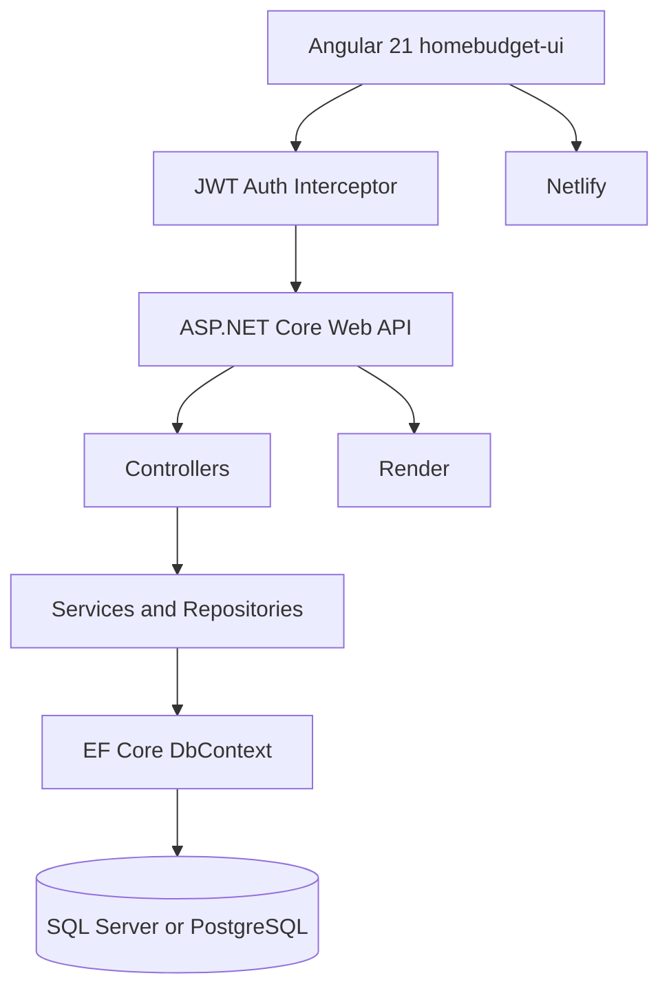

# HomeBudgetAI


HomeBudgetAI is a premium fintech SaaS portfolio application for household finance intelligence. It pairs an Angular 21 standalone frontend with an ASP.NET Core .NET 8 API, JWT authentication, EF Core, SQL Server/PostgreSQL support, animated Chart.js dashboards, PDF/CSV reporting, budgets, goals, settings, notifications, and polished responsive UX.

## Highlights

- Public SaaS landing page with hero, feature, analytics, testimonial, pricing, FAQ, and footer sections.
- Premium auth flows: login, multi-step registration, forgot password, reset password, validation, demo credentials, and protected routes.
- App workspace with collapsible sidebar, sticky topbar, global-search style UI, dark/light mode, notification center, profile menu, and mobile bottom nav.
- Dashboard with animated counters, income/expense charts, savings trend, category analytics, heatmap, quick actions, recent transactions, and AI insight cards.
- Transactions with search, filters, sorting, pagination, create/edit/delete, CSV export, loading skeletons, and empty states.
- Budgets, goals, reports, activity, settings, and profile pages connected to backend APIs.
- Backend features: JWT auth, refresh-token-ready sessions, role policies, rate limiting, global exception middleware, repository/service boundaries, EF migrations, demo seed data, and Swagger.

## Architecture



## Tech Stack

- Frontend: Angular 21 standalone components, Tailwind CSS, Bootstrap utilities, RxJS, Chart.js, lucide-angular, jspdf, html2canvas.
- Backend: ASP.NET Core .NET 8 Web API, EF Core, JWT Bearer auth, rate limiting, Swagger.
- Databases: SQL Server locally, PostgreSQL-ready for Render.
- Deployment: Netlify frontend, Render backend, GitHub Actions-ready repository layout.

## Local Setup

```powershell
cd D:\project\homebudgetai-fullstack\homebudget-ui
npm ci
npm run build -- --configuration production
npm start
```

```powershell
cd D:\project\homebudgetai-fullstack
 dotnet restore .\HomeBudgetAPI\HomeBudgetAPI.csproj
 dotnet build .\HomeBudgetAPI\HomeBudgetAPI.csproj -c Release
 dotnet run --project .\HomeBudgetAPI\HomeBudgetAPI.csproj
```

Default demo login:

- Email: `demo@homebudget.ai`
- Password: `Demo@12345`

## Environment Variables

Copy `.env.example` and configure the API/database values for your environment. Required backend values:

- `DatabaseProvider`: `SqlServer`, `PostgreSQL`, or `Postgres`
- `ConnectionStrings__DefaultConnection`
- `Jwt__Key`
- `Jwt__Issuer`
- `Jwt__Audience`
- `Cors__AllowedOrigins__0`
- `SeedDemoData`

## API Overview

Swagger is available at `/swagger` when the API is running.

Primary endpoints:

- `POST /api/Auth/register`, `POST /api/Auth/login`, `POST /api/Auth/refresh`, `GET /api/Auth/me`
- `GET/POST/PUT/DELETE /api/Transactions`
- `GET/POST/PUT/DELETE /api/Budgets`
- `GET/POST/PUT /api/Goals`
- `GET /api/Reports/summary`, `GET /api/Reports/export`
- `GET /api/Notifications`, `POST /api/Notifications/{id}/read`
- `GET/PUT /api/Settings`
- `GET/PUT /api/Profile`, `POST /api/Profile/change-password`

## Deployment

### Netlify

`netlify.toml` builds from `homebudget-ui`:

```toml
[build]
  base = "homebudget-ui"
  command = "npm ci && npm run build -- --configuration production"
  publish = "dist/homebudget-ui/browser"
```

### Render

`render.yaml` deploys `HomeBudgetAPI` with Docker, PostgreSQL provider, JWT environment values, and `/api/health` health checks.

## Screenshots

Add production screenshots after deployment:

- Landing page
- Login/register
- Dashboard
- Transactions
- Budgets
- Reports
- Mobile workspace

## Contributing

1. Create a feature branch.
2. Keep frontend work in `homebudget-ui` and backend work in `HomeBudgetAPI`.
3. Run Angular production build and .NET Release build before opening a PR.
4. Include screenshots for UI changes and notes for API/database changes.

## License

MIT. See `LICENSE` if present, or add the standard MIT license text before publishing as an open-source project.
